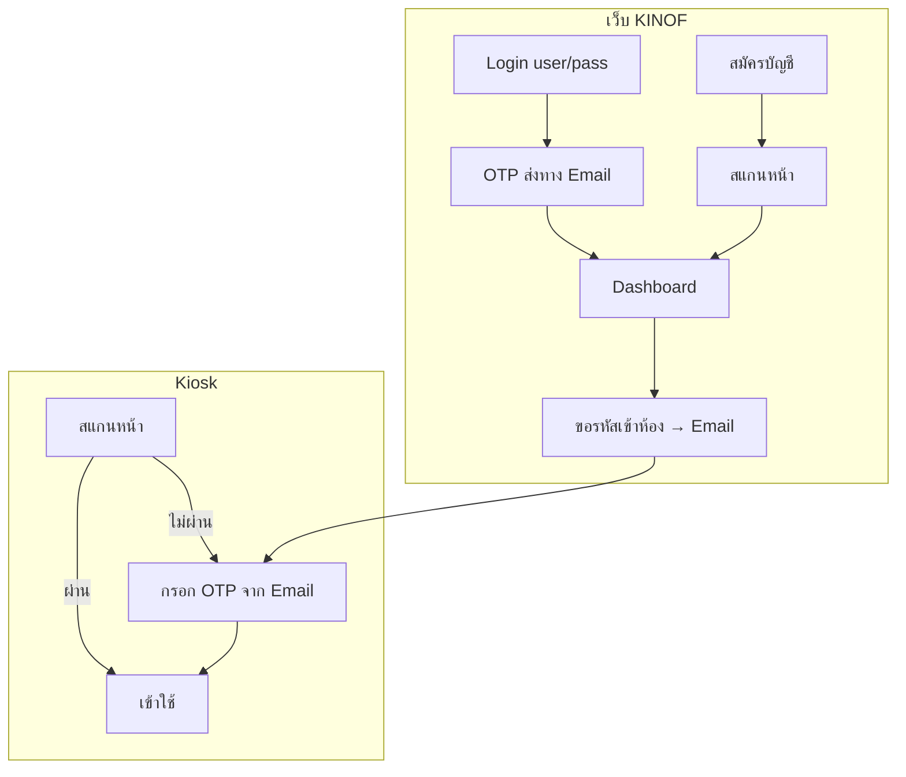

# KINOF — หน้า Login & Auth (Phase 0)

> OTP ชั้น 2: **ส่งทางอีเมล** (ไม่ใช้ Google Authenticator) — ดู [EMAIL_OTP.md](./EMAIL_OTP.md)

## หน้าจอจาก Mockup (ลำดับ Flow)

| # | หน้า | Route | ใช้เมื่อไหร่ |
|---|------|-------|-------------|
| 1 | เข้าสู่ระบบ | `/login` | ทุกคน login เว็บ |
| 2 | ยืนยัน OTP | `/login/otp` | หลัง login — **OTP ส่งไปอีเมล** |
| 3 | ลืมรหัสผ่าน | `/forgot-password` | Reset ผ่าน email |
| 4 | สมัครบัญชี | `/register` | External + นักศึกษาใหม่ |
| 5 | ยืนยันใบหน้า (คำแนะนำ) | `/register/face` | Sign-Up2 |
| 6 | สแกนใบหน้า + กระพริบตา | `/register/face/scan` | Sign-Up3 — liveness |
| 7 | ยืนยันสำเร็จ | `/register/face/success` | เก็บ embedding → Dashboard |

---

## OTP ทาง Email (ชั้น 2)

| งาน | เทคโนologi |
|-----|-------------|
| สร้าง OTP 6 หลัก | `RandomNumberGenerator` / crypto random |
| เก็บ DB | ตาราง `email_otps` (hash, 10 นาที, one-time) |
| ส่ง email | **MailKit** (.NET) หรือ **nodemailer** (Node) |
| หน้า verify | `/login/otp` + ปุ่ม "ส่ง OTP ใหม่" |

---

## Data Model — ดู [DATABASE.md](./DATABASE.md)

```typescript
interface User {
  id: string;
  username: string;
  email: string;        // ใช้ส่ง OTP
  firstName: string;
  lastName: string;
  userType: 'student' | 'staff' | 'external' | 'admin';
  status: 'active' | 'disabled';
  faceEnrolled: boolean;
}
```

---

## Flow Auth



---

## Tech Stack

```
Frontend:  React + TypeScript + Tailwind + React Router
Auth:      JWT + bcrypt
Email OTP: MailKit (SMTP) — ไม่ใช้ otplib/TOTP
Face:      MediaPipe + InsightFace
Backend:   ASP.NET Core 8 หรือ Node.js
DB:        SQLite (dev) / PostgreSQL (prod) — 15 ตาราง
```

---

## API Endpoints

```
POST /api/auth/login              → ส่ง OTP email → { requiresOtp, userId, maskedEmail }
POST /api/auth/verify-email-otp   → { userId, code } → { accessToken, refreshToken, user }
POST /api/auth/resend-email-otp   → { userId } → ส่ง OTP ใหม่
POST /api/auth/register
POST /api/auth/register/face
POST /api/auth/forgot-password
POST /api/auth/reset-password
POST /api/auth/entry-otp          → ส่ง OTP เข้าห้องทาง email
GET  /api/auth/me
```

---

## Checklist Phase 0

- [ ] React + AuthLayout ตาม mockup
- [ ] Login + Forgot Password + Register
- [ ] Backend: login → ส่ง email OTP
- [ ] หน้า /login/otp (masked email + resend)
- [ ] MailKit + SMTP config (dev: log console / Mailpit)
- [ ] DB 15 ตาราง + migration
- [ ] Face scan (รอบ 2)
