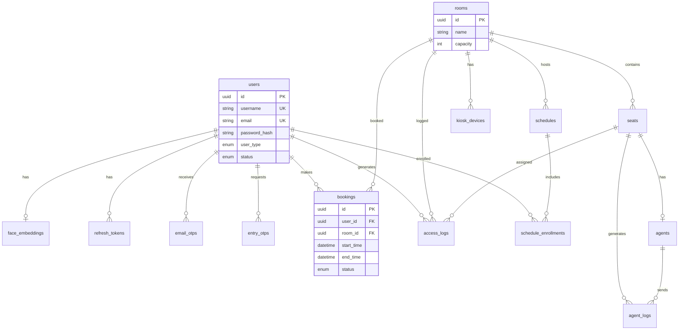

# Smart Lab (KINOF) — Database Design

> สร้าง **ครบ schema ตั้งแต่ Phase 0** (Login) — ตาราง Phase ถัดไปสร้างไว้เปล่า/seed ได้เลย  
> **Dev:** SQLite | **Production:** PostgreSQL

---

## ER Diagram



---

## ตารางทั้งหมด (15 ตาราง)

### Phase 0 — สร้างทันที (Login + Auth)

#### 1. `users`

| Column | Type | Notes |
|--------|------|-------|
| id | UUID PK | |
| student_id | VARCHAR(20) NULL | รหัสนักศึกษา (กลุ่ม 1, 2) |
| username | VARCHAR(50) UNIQUE NOT NULL | |
| email | VARCHAR(255) UNIQUE NOT NULL | |
| password_hash | VARCHAR(255) NOT NULL | bcrypt |
| first_name | VARCHAR(100) NOT NULL | |
| last_name | VARCHAR(100) NOT NULL | |
| phone | VARCHAR(20) NULL | |
| user_type | ENUM | `student`, `staff`, `external`, `admin` |
| status | ENUM | `active`, `disabled` — default `active` |
| face_enrolled | BOOLEAN | default false |
| created_at | TIMESTAMP | |
| updated_at | TIMESTAMP | |

> **ไม่ใช้ Google Authenticator** — OTP ชั้น 2 ส่งทาง **email** (ตาราง `email_otps`)

**Indexes:** `username`, `email`, `student_id`, `user_type`

---

#### 2. `face_embeddings`

| Column | Type | Notes |
|--------|------|-------|
| id | UUID PK | |
| user_id | UUID FK → users | ON DELETE CASCADE |
| embedding | TEXT NOT NULL | JSON array 512 floats (InsightFace) |
| is_primary | BOOLEAN | default true |
| created_at | TIMESTAMP | |

> เก็บ embedding ไม่เก็บรูปดิบ (PDPA)

---

#### 3. `refresh_tokens`

| Column | Type | Notes |
|--------|------|-------|
| id | UUID PK | |
| user_id | UUID FK → users | |
| token_hash | VARCHAR(255) NOT NULL | hash ของ refresh token |
| expires_at | TIMESTAMP NOT NULL | 7 วัน |
| revoked_at | TIMESTAMP NULL | |
| created_at | TIMESTAMP | |

---

#### 4. `password_reset_tokens`

| Column | Type | Notes |
|--------|------|-------|
| id | UUID PK | |
| user_id | UUID FK → users | |
| token_hash | VARCHAR(255) NOT NULL | |
| expires_at | TIMESTAMP NOT NULL | 1 ชม. |
| used_at | TIMESTAMP NULL | |
| created_at | TIMESTAMP | |

---

#### 5. `email_otps`

OTP ส่งทาง **อีเมล** — ใช้ Login ชั้น 2 (แทน Google Authenticator)

| Column | Type | Notes |
|--------|------|-------|
| id | UUID PK | |
| user_id | UUID FK → users | |
| code_hash | VARCHAR(255) NOT NULL | hash OTP 6 หลัก |
| purpose | ENUM | `login` — ยืนยันหลัง login |
| expires_at | TIMESTAMP NOT NULL | 10 นาที |
| used_at | TIMESTAMP NULL | one-time |
| created_at | TIMESTAMP | |

**Rate limit:** ส่งใหม่ได้ไม่เกิน 3 ครั้ง/ชม.

---

#### 6. `entry_otps`

รหัสเข้าห้อง Lab สำรอง — **ส่งทางอีเมล** เมื่อขอจากเว็บ (Kiosk สแกนไม่ผ่าน)

| Column | Type | Notes |
|--------|------|-------|
| id | UUID PK | |
| user_id | UUID FK → users | |
| room_id | UUID FK → rooms NULL | optional |
| code_hash | VARCHAR(255) NOT NULL | hash OTP 6 หลัก |
| expires_at | TIMESTAMP NOT NULL | 10 นาที |
| used_at | TIMESTAMP NULL | one-time |
| created_at | TIMESTAMP | |

---

### Phase 1–3 — สร้างพร้อม Phase 0 (ตารางเปล่า + seed ข้อมูล lab)

#### 7. `rooms`

| Column | Type | Notes |
|--------|------|-------|
| id | UUID PK | |
| name | VARCHAR(100) NOT NULL | เช่น "Lab A" |
| building | VARCHAR(100) NULL | |
| capacity | INT NOT NULL | จำนวนเครื่อง/ที่นั่ง |
| status | ENUM | `open`, `closed`, `maintenance` |
| created_at | TIMESTAMP | |

---

#### 8. `seats`

| Column | Type | Notes |
|--------|------|-------|
| id | UUID PK | |
| room_id | UUID FK → rooms | |
| seat_number | INT NOT NULL | 1, 2, 3... |
| computer_name | VARCHAR(100) NULL | PC-LAB-A-01 |
| status | ENUM | `available`, `occupied`, `offline` |
| UNIQUE | (room_id, seat_number) | |

---

#### 9. `agents`

Tracking Agent บน PC แต่ละเครื่อง

| Column | Type | Notes |
|--------|------|-------|
| id | UUID PK | |
| seat_id | UUID FK → seats UNIQUE | |
| api_key | VARCHAR(255) NOT NULL | |
| hostname | VARCHAR(255) | |
| last_heartbeat | TIMESTAMP NULL | |
| created_at | TIMESTAMP | |

---

#### 9b. `kiosk_devices`

เครื่อง Kiosk หน้าประตู — ผูก **ห้อง** ไม่ผูกที่นั่ง (`agents` ผูกที่นั่ง)

| Column | Type | Notes |
|--------|------|-------|
| id | UUID PK | |
| room_id | UUID FK → rooms | ON DELETE CASCADE |
| api_key | VARCHAR(255) UNIQUE NOT NULL | แสดงครั้งเดียวตอนสร้าง |
| label | VARCHAR(100) NULL | เช่น "เครื่องประตู" |
| revoked_at | TIMESTAMP NULL | เพิกถอนแล้วใช้ไม่ได้ |
| last_seen_at | TIMESTAMP NULL | ใช้คีย์ล่าสุด |
| created_at | TIMESTAMP | |

Header ที่ประตู: `X-Kiosk-Key` — คีย์ห้องอื่นใช้ไม่ได้

---

#### 10. `schedules`

ตารางเรียน (กลุ่ม 1)

| Column | Type | Notes |
|--------|------|-------|
| id | UUID PK | |
| room_id | UUID FK → rooms | |
| course_code | VARCHAR(50) | |
| course_name | VARCHAR(255) NULL | |
| day_of_week | INT | 0=Sun ... 6=Sat |
| start_time | TIME | |
| end_time | TIME | |
| semester | VARCHAR(20) NULL | |

---

#### 11. `schedule_enrollments`

นักศึกษาในตารางเรียน

| Column | Type | Notes |
|--------|------|-------|
| id | UUID PK | |
| schedule_id | UUID FK → schedules | |
| user_id | UUID FK → users | |
| UNIQUE | (schedule_id, user_id) | |

---

#### 12. `bookings`

จองห้อง (กลุ่ม 2, 3)

| Column | Type | Notes |
|--------|------|-------|
| id | UUID PK | |
| user_id | UUID FK → users | |
| room_id | UUID FK → rooms | |
| seat_id | UUID FK → seats NULL | assign ตอนเข้า |
| start_time | TIMESTAMP NOT NULL | |
| end_time | TIMESTAMP NOT NULL | |
| status | ENUM | `confirmed`, `cancelled`, `completed`, `expired` |
| created_at | TIMESTAMP | |

---

#### 13. `access_logs`

บันทึกการเข้า-ออกห้อง

| Column | Type | Notes |
|--------|------|-------|
| id | BIGSERIAL PK | |
| user_id | UUID FK → users | |
| room_id | UUID FK → rooms | |
| seat_id | UUID FK → seats NULL | |
| auth_method | ENUM | `face`, `otp_fallback` |
| auth_result | ENUM | `granted`, `denied` |
| deny_reason | VARCHAR(255) NULL | |
| created_at | TIMESTAMP | |

---

#### 14. `agent_logs`

Log จาก Tracking Agent

| Column | Type | Notes |
|--------|------|-------|
| id | BIGSERIAL PK | |
| agent_id | UUID FK → agents | |
| event_type | VARCHAR(50) | `login`, `logout`, `program`, `website`, `suspicious`, `unknown_program` |
| data_json | TEXT | |
| created_at | TIMESTAMP | |

---

#### 15. `website_blacklist`

| Column | Type | Notes |
|--------|------|-------|
| id | SERIAL PK | |
| url_pattern | VARCHAR(255) NOT NULL | |
| category | VARCHAR(50) | หมวด UT1 เช่น `social_networks` / `streaming` / `games` หรือ `social` / `manual` เมื่อใส่เอง |
| source | VARCHAR(20) | `manual` หรือ `ut1` — นำเข้าหมวดจะตั้ง `ut1` และซิงค์ `category` จากรหัสหมวด |
| created_by | UUID FK → users NULL | |
| created_at | TIMESTAMP | |

---

#### 16. `program_blacklist`

รายชื่อไฟล์ `.exe` ที่แอดมินห้ามใช้บนเครื่องแล็บ  
หน้า Monitor ตั้งค่าได้ — Agent ดึงตามรอบ heartbeat แล้วปิด process ที่ตรง `process_name` (ไม่ปิดเครื่อง / ไม่ปิดตัว Agent / ไม่ปิด process ระบบ)

| Column | Type | Notes |
|--------|------|-------|
| id | SERIAL PK | |
| process_name | VARCHAR(255) NOT NULL UNIQUE | เช่น `discord.exe` |
| category | VARCHAR(50) | chat, game, manual... |
| created_by | UUID FK → users NULL | |
| created_at | TIMESTAMP | |

---

#### 17. `program_allowlist`

ซอฟต์แวร์ที่ห้องแล็บอนุญาตให้ใช้ (สิบถึงห้าสิบตัว)  
หน้า Monitor แท็บ **อนุญาตโปรแกรม** ตั้งค่าได้ — Agent ดึงตาม heartbeat เพื่อแยกของที่ไม่รู้จักออกจากคิว Monitor

| Column | Type | Notes |
|--------|------|-------|
| id | SERIAL PK | |
| process_name | VARCHAR(255) NOT NULL UNIQUE | เช่น `chrome.exe` |
| display_name | VARCHAR(120) NULL | ชื่อที่โชว์ในหน้าแอดมิน |
| category | VARCHAR(50) | browser, office, dev, lab |
| created_by | UUID FK → users NULL | |
| created_at | TIMESTAMP | |

---

#### 18. `behavior_penalties`

ประวัติหักคะแนนพฤติกรรม — คะแนนปัจจุบัน = `max(0, 100 - sum(points))`  
หักอัตโนมัติเมื่อไม่มาตามจอง (`no_show`, ครั้งละ 5)  
กิจกรรมที่ Agent จับได้ขึ้นคิว `behavior_reviews` ก่อน — แอดมินกดแย่จึงหัก (`flagged`, ครั้งละ 5 ต่อรายการ)

| Column | Type | Notes |
|--------|------|-------|
| id | UUID PK | |
| user_id | UUID FK → users | |
| points | INT | คะแนนที่หัก |
| reason | VARCHAR(500) | ข้อความที่โชว์ในโปรไฟล์ |
| source | VARCHAR(40) | `no_show` หรือ `flagged` |
| source_key | VARCHAR(200) UNIQUE | กันหักซ้ำ |
| created_at | TIMESTAMP | |

---

#### 19. `behavior_reviews`

คิวให้แอดมินตรวจกิจกรรมที่ Agent ทำเครื่องหมายน่าสงสัย — ยังไม่หักคะแนนจนกว่าจะกดแย่

| Column | Type | Notes |
|--------|------|-------|
| id | UUID PK | |
| user_id | UUID FK → users NULL | |
| display_name | VARCHAR(120) | |
| username | VARCHAR(50) | |
| room_id / seat_id | UUID NULL | |
| room_name / seat_label | VARCHAR | |
| kind | VARCHAR(20) | `website` / `program` / `suspicious` |
| target | VARCHAR(255) | โดเมน หรือชื่อโปรแกรม หรือข้อความกิจกรรม |
| activity | VARCHAR(500) | คำอธิบายที่โชว์ใน Monitor |
| queue_key | VARCHAR(320) | รวมผู้ใช้+ชนิด+เป้าหมาย — unique ตอน `Pending` |
| occurrence_count | INT | จำนวนครั้งที่เจอซ้ำขณะรอตรวจ |
| first_seen_at / last_seen_at | TIMESTAMP | |
| status | VARCHAR(20) | `Pending` / `Cleared` / `Penalized` |
| reviewed_by | UUID FK → users NULL | |
| reviewed_at | TIMESTAMP NULL | |

---

```sql
-- Admin
INSERT INTO users (id, username, email, password_hash, first_name, last_name,
  user_type, status, face_enrolled)
VALUES ('...', 'admin', 'admin@kinof.local', '$2b$...', 'Admin', 'System',
  'admin', 'active', false, false);

-- ห้อง Lab ตัวอย่าง
INSERT INTO rooms (id, name, building, capacity, status)
VALUES
  ('...', 'Lab A', 'อาคาร IT', 30, 'open'),
  ('...', 'Lab B', 'อาคาร IT', 25, 'open');

-- seats 1-30 สำหรับ Lab A (script generate)
-- blacklist เริ่มต้น
INSERT INTO website_blacklist (url_pattern, category) VALUES
  ('facebook.com', 'social'),
  ('tiktok.com', 'social'),
  ('twitter.com', 'social');
```

---

## โครงสร้างในโปรเจกต

```
backend/
├── SmartLab.Api/
│   ├── Data/
│   │   ├── AppDbContext.cs
│   │   ├── Entities/          ← 1 file per table
│   │   ├── Migrations/        ← EF Core migrations
│   │   └── DbSeeder.cs        ← seed admin + rooms
│   └── appsettings.json       ← ConnectionStrings
```

**Connection string:**
```json
{
  "ConnectionStrings": {
    "Default": "Data Source=smartlab.db"
  }
}
```

PostgreSQL (prod):
```
Host=localhost;Database=smartlab;Username=postgres;Password=...
```

---

## Phase 0 ต้อง implement อะไรใน DB

| ตาราง | Phase 0 | หมายเหตุ |
|-------|---------|----------|
| users | ✅ CRUD | register, login |
| face_embeddings | ✅ insert | หลัง face enroll |
| refresh_tokens | ✅ | JWT refresh |
| password_reset_tokens | ✅ | forgot password |
| email_otps | ✅ | ส่ง OTP login ทาง email |
| entry_otps | ✅ schema | ส่ง OTP เข้าห้องทาง email — Phase 2 |
| rooms | ✅ seed | จองห้อง Phase 3 |
| seats | ✅ seed | |
| agents | schema only | Phase 1 Agent |
| schedules | schema only | Phase 2 |
| schedule_enrollments | schema only | Phase 2 |
| bookings | schema only | Phase 3 |
| access_logs | schema only | Phase 2 Kiosk |
| agent_logs | schema only | Phase 1 |
| website_blacklist | ✅ seed + หน้า Monitor + นำเข้าหมวด UT1 | Agent บังคับ hosts แล้ว · `category` ซิงค์จาก UT1 เมื่อนำเข้า |
| program_blacklist | ✅ seed + หน้า Monitor | Agent ปิด process ที่ตรงชื่อแล้ว |
| program_allowlist | ✅ seed ซอฟต์แวร์แล็บ + หน้า Monitor | Agent ใช้แยกของที่ไม่รู้จัก |
| kiosk_devices | ✅ แอดมินสร้าง/เพิกถอน | `X-Kiosk-Key` ผูกห้อง · apiKey ครั้งเดียวตอนสร้าง |
| behavior_penalties | ✅ หักคะแนน | no-show อัตโนมัติ / flagged หลังแอดมินกดแย่ |
| behavior_reviews | ✅ คิวตรวจ | Agent flagged รอแอดมิน ดี/แย่ — **ไม่รวม** โปรแกรมที่ไม่รู้จัก |

> **แนะนำ:** สร้าง migration ครบ 15 ตารางตั้งแต่ Phase 0

---

## Enum Values สรุป

```typescript
type UserType = 'student' | 'staff' | 'external' | 'admin';
type UserStatus = 'active' | 'disabled';
type RoomStatus = 'open' | 'closed' | 'maintenance';
type SeatStatus = 'available' | 'occupied' | 'offline';
type BookingStatus = 'confirmed' | 'cancelled' | 'completed' | 'expired';
type AuthMethod = 'face' | 'otp_fallback';
type AuthResult = 'granted' | 'denied';
```

---

## ความปลอดภัย

| ข้อมูล | วิธีเก็บ |
|--------|---------|
| password | bcrypt cost 12 |
| email_otp / entry_otp | เก็บ hash, one-time, 10 min |
| refresh_token | เก็บ hash เท่านั้น |
| face_embedding | JSON floats — ไม่เก็บรูป |
| api_key (agent) | random 32 bytes, hash optional |
